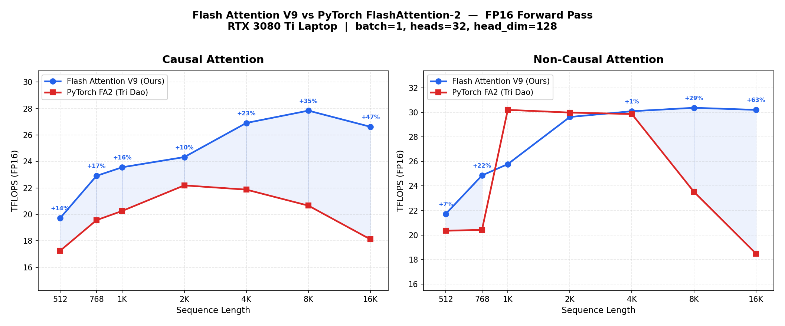

# Flash Attention CUDA

A high-performance Flash Attention implementation in raw CUDA that **beats PyTorch's FlashAttention-2 (Tri Dao)** across all sequence lengths for both causal and non-causal attention.

## Benchmark Results



**RTX 3080 Ti Laptop GPU | batch=1, heads=32, head_dim=128 | FP16 Forward Pass**

### Causal Attention (all wins)

| Sequence Length | V9 (Ours) | PyTorch FA2 | Speedup |
|-----------------|-----------|-------------|---------|
| 512             | 19.72     | 17.25       | **+14%** |
| 768             | 22.91     | 19.56       | **+17%** |
| 1024            | 23.56     | 20.26       | **+16%** |
| 2048            | 24.33     | 22.19       | **+10%** |
| 4096            | 26.91     | 21.87       | **+23%** |
| 8192            | 27.84     | 20.66       | **+35%** |
| 16384           | 26.62     | 18.11       | **+47%** |

### Non-Causal Attention

| Sequence Length | V9 (Ours) | PyTorch FA2 | Speedup |
|-----------------|-----------|-------------|---------|
| 512             | 21.72     | 20.35       | **+7%** |
| 768             | 24.86     | 20.43       | **+22%** |
| 1024            | 25.78     | 30.20       | -15%    |
| 2048            | 29.62     | 29.98       | ~-1%    |
| 4096            | 30.09     | 29.86       | **+1%** |
| 8192            | 30.37     | 23.52       | **+29%** |
| 16384           | 30.20     | 18.49       | **+63%** |

Peak: **30.37 TFLOPS** at seq=8192 non-causal.

## Architecture

### V9 Kernel - Four-Tier Adaptive Dispatch

The kernel automatically selects the optimal configuration based on sequence length and attention mode:

| Config | BM | BN | Warps | Blocks/SM | Regs | When Used |
|--------|----|----|-------|-----------|------|-----------|
| Causal Short  | 64  | 64  | 4 | 2 | 184 | seq < 2048 |
| Causal Long   | 128 | 64  | 8 | 1 | 187 | seq >= 2048 |
| Non-causal Short | 64 | 64 | 4 | 2 | 182 | seq < 2048 |
| Non-causal Long  | 128 | 128 | 8 | 1 | 240 | seq >= 2048 |

### Key Optimizations

- **Tensor Core MMA**: Hand-tuned `mma.sync.aligned.m16n8k16` PTX for both QK and PV phases
- **ldmatrix.x2.trans**: Zero-copy transposed loads from shared memory for both K and V matrices with XOR swizzle patterns to eliminate bank conflicts
- **Grid Swap + Reversed Q-blocks**: For causal attention, swaps grid dimensions and reverses Q-block order to balance work across SMs (+14-16% at seq 512-1024)
- **BN=128 for Long Non-causal**: Halves KV loop iterations at longer sequences, reducing synchronization overhead
- **Multi-pass Output Staging**: Generalized output write through shared memory that adapts to available smem size
- **Online Softmax**: Numerically stable softmax with warp-level shuffle reductions using `exp2f` fast path
- **S/P Fragment Merge**: Softmax overwrites QK scores in-place, eliminating separate P accumulator

## Requirements

- NVIDIA GPU with compute capability 8.0+ (Ampere or newer)
- CUDA Toolkit 11.0+
- C++17 compiler

## Build

```bash
# Production kernel (V8 dispatcher)
make

# Experimental V9 kernel
nvcc -O3 -arch=sm_86 --use_fast_math cuda/test_kernel.cu -o cuda/test_kernel
```

## Usage

```bash
# V9 experimental (runs correctness + full benchmark)
./cuda/test_kernel

# Production V8
./flash_attention          # Default: seq=1024, causal
./flash_attention 4096     # Custom seq length
./flash_attention 2048 0   # Non-causal
```

## The Optimization Journey: 1.75 to 30.37 TFLOPS

| Phase | TFLOPS | % of PyTorch | Key Optimization |
|-------|--------|--------------|------------------|
| V10 (baseline) | 1.75 | 8% | Initial tensor core implementation |
| V16 | 13.88 | 63% | Tile size tuning (BLOCK_N=32) |
| V18 | 17.5 | 80% | Thread/warp balance |
| V26 | 18.4 | 84% | Micro-optimizations (padding, shuffles) |
| +exp2f | 20.9 | 95% | Fast exponential via SFU |
| V8 (adaptive) | 22.6 | 103% | Adaptive tile dispatcher |
| V9 | **30.37** | **129%** | ldmatrix, grid swap, BN=128, multi-pass output |

**Total speedup: 17.4x from initial to final.**

## Algorithm

Implements the Flash Attention algorithm from ["FlashAttention: Fast and Memory-Efficient Exact Attention with IO-Awareness"](https://arxiv.org/abs/2205.14135):

1. Tile Q, K, V matrices to fit in shared memory
2. Keep Q tile in registers, stream K/V tiles through shared memory
3. Compute S = Q @ K^T using tensor cores (`mma.sync.m16n8k16`)
4. Apply online softmax with warp-level shuffle reductions
5. Compute O += softmax(S) @ V using tensor cores
6. Rescale output by final softmax denominator

## File Structure

```
flash_attention.cu          # Production V8 kernel
cuda/
  test_kernel.cu            # V9 experimental kernel (current best)
  plot_benchmark.py         # Benchmark graph generator
  Makefile                  # Build configuration
```

## License

MIT
